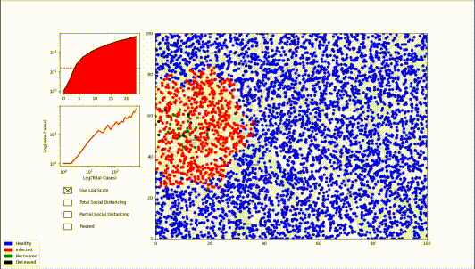
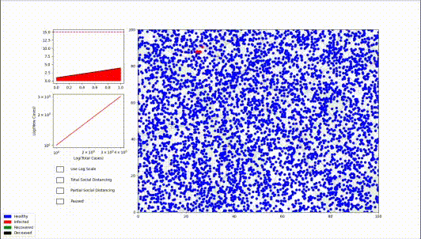

# COVID-19 Simulator

This directory hosts a very basic COVID-19 Simulator. It generates a population
of people (`5000` by default), infects some of them at the very start, places
all of them in a square arena, and simulates forward.

The simulator incorporates randomness heavily. Everyone's movement is random,
with each person's `x` and `y` displacement distributed normally for each
timestep. If a healthy person is too close to some infected people, the
simulation "rolls" for infection as many times as there are people in the
"infection range." After some time being infected, a person will randomly either
recover or die. There's also the option to enable partial social distancing,
which is implemented stochastically - everyone rolls for movement on each
timestep.

As stated before, this simulator is very basic, and there are many factors it
doesn't consider. It assumes that recovered people have no chance of getting
infected again. People move around randomly, unlike in real life where people
have goals and routines. It also assumes people don't voluntarily gather, though
a rudimentary version of that featurecan be implemented quite easily: every so
often, randomly select some people to meet and be in close contact for that
timestep.

It's also worth noting that this simulator is incredibly slow. It runs at close
to `1 FPS`, and all the `gif`s on this page had to be sped up by a factor of
60.

# Features

## Total Cases vs. New Cases Graph

In addition to the standard population breakdown over time graph, the program
also computes and displays a graph of the new cases on a given timestep plotted
against the total number of cases up to that timestep. This was inspired by the
work of [aatishb](https://aatishb.com) and
[minutephysics](https://youtube.com/user/minutephysics), available at
[aatishb.com/covidtrends](https://aatishb.com/covidtrends).

## Log Scaled Population vs. Time Graph

The interface has a checkbox which allows you to select the scale for the
population vs. time graph. Usually it's displayed with a linear scale, but
checking the appropriate box plots the population axis on a log scale instead.

Note that this doesn't affect the other graph, which is always plotted with both
axes on a log scale.

## Total and Partial Social Distancing

The simulator also includes options to see the effects of social distancing
implemented at different times during the pandemic. It's implemented by
assigning to everyone a probablility of moving on a given timestep. When no
social distancing is in place, that probability is `1.0`. Total social
distancing drops that probability to `0.0`, and partial social distancing puts
the probability somewhere in between - `0.6` by default.
